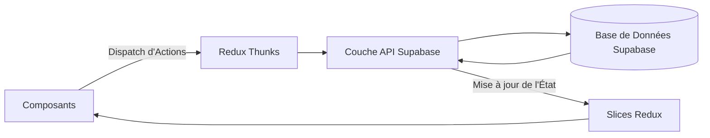

# Client Management Application

Une application web moderne construite avec React, Redux Toolkit et Supabase pour la gestion des profils clients avec un contrôle d'accès basé sur les rôles (ADMIN/USER). Elle intègre un système d'authentification sécurisé, des workflows de validation de clients, des optimisations de rendu et un système de notifications en temps réel.

## 🚀 Fonctionnalités

### 🔒 Système d'Authentification
- **Inscription multi-rôles** (ADMIN/USER) avec vérification d'email
- Flux d'authentification basé sur JWT avec Supabase
- Protection des routes via un composant `PrivateRoute`
- Création automatique d'un profil utilisateur dans la table `profiles` lors de l'inscription
- Gestion des sessions avec Redux (`userSlice`)

### 👥 Gestion des Profils Clients
- **Architecture à double table** :
  - `clientstemp` pour les demandes en attente de validation
  - `clients` pour les entrées validées
- **Flux de validation basé sur les rôles** :
  - Les utilisateurs peuvent créer, modifier et supprimer leurs demandes
  - Les administrateurs peuvent approuver ou rejeter les demandes
- Opérations CRUD avec mises à jour en temps réel via Supabase
- Gestion centralisée de l'état avec Redux (`clientsSlice`)

### 🔔 Système de Notifications
- Notifications en temps réel pour les demandes de validation
- Affichage des notifications persistantes avec possibilité d'annulation
- Suppression automatique des notifications après 10 secondes, sauf si l'utilisateur survole l'élément
- Gestion optimisée avec Redux (`notificationsSlice`)

### 🛡 Architecture Sécurisée
- Protection des routes en fonction de l'état d'authentification
- Rendu dynamique de la navigation en fonction du rôle
- Deux layouts distincts :
  - `AuthLayout` pour les pages de connexion/inscription
  - `MainLayout` pour le contenu authentifié

## 🏗 Structure du Projet

```plaintext
src/
├── api/               # Abstractions pour Supabase
│   ├── authApi.js
│   ├── clientsApi.js
│   ├── notificationsApi.js
│   └── supabaseClient.js
│
├── features/          # Modules basés sur les fonctionnalités
│   ├── auth/         # Gestion de l'authentification
│   ├── clients/      # Gestion des clients
│   ├── admin/        # Interfaces administrateurs
│   ├── notifications/ # Système de notifications
│   └── home/         # Pages d'accueil
│
├── redux/            # Gestion de l'état
│   ├── store.js
│   ├── slices/       # Slices Redux Toolkit
│       ├── clientsSlice.js
│       ├── userSlice.js
│       └── notificationsSlice.js
│
├── services/         # Couche métier
│   ├── authService.js
│   ├── clientsService.js
│   └── notificationsService.js
│
├── layouts/          # Agencement des interfaces
├── routes/           # Configuration du routage
└── common/           # Composants réutilisables et utilitaires
```

## ⚡ Optimisations de Performance
### Mémoïsation des composants :
- `React.memo` pour éviter les rendus inutiles
- `useMemo` et `useCallback` pour optimiser les opérations coûteuses

### Découpage du code :
- Chargement différé des routes avec `React.lazy()`
- Importation dynamique pour les fonctionnalités admin
- **Styling optimisé** avec SCSS Modules
- **Requêtes Supabase optimisées** avec filtres et index

## 🔄 Flux de Données


## 📊 Schéma de la Base de Données Supabase

### Authentification :
```sql
CREATE TABLE public.users (
  id UUID PRIMARY KEY REFERENCES auth.users,
  email TEXT
);
```

### Profils Utilisateurs :
```sql
CREATE TABLE public.profiles (
  id UUID PRIMARY KEY REFERENCES auth.users,
  role VARCHAR(5) CHECK (role IN ('ADMIN', 'USER'))
);
```

### Données Clients :
```sql
CREATE TABLE public.clientstemp (
  id UUID PRIMARY KEY,
  data JSONB,
  owner UUID REFERENCES profiles(id),
  created_at TIMESTAMP
);

CREATE TABLE public.clients (
  id UUID PRIMARY KEY,
  data JSONB,
  owner UUID REFERENCES profiles(id),
  approved_by UUID REFERENCES profiles(id),
  created_at TIMESTAMP
);
```

### Notifications :
```sql
CREATE TABLE public.notifications (
  id UUID PRIMARY KEY,
  user_id UUID REFERENCES profiles(id),
  message TEXT,
  status VARCHAR(10) CHECK (status IN ('UNREAD', 'READ')),
  created_at TIMESTAMP DEFAULT NOW()
);
```

## 📥 Installation et Démarrage

1. **Cloner le dépôt**
```bash
git clone git@github.com:issamedine/client-management-app.git
```

2. **Configurer l'environnement**
```bash
cp .env.example .env
# Ajouter les identifiants Supabase
REACT_APP_SUPABASE_URL=your-project-url
REACT_APP_SUPABASE_KEY=your-key
```

3. **Installer les dépendances**
```bash
npm install
npm run start
```

4. **Build de production**
```bash
npm run build
```

---
✅ **Le projet est maintenant prêt à être utilisé avec une gestion avancée des clients et des notifications en temps réel !** 🎉

